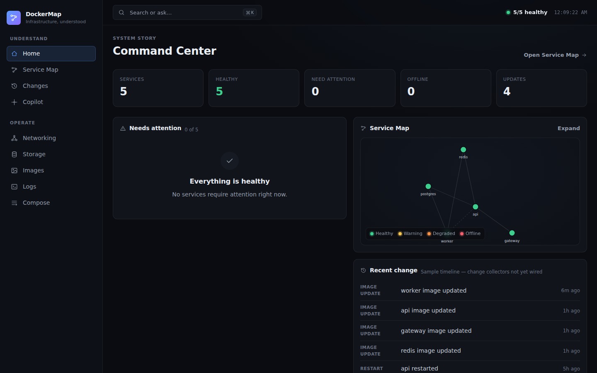
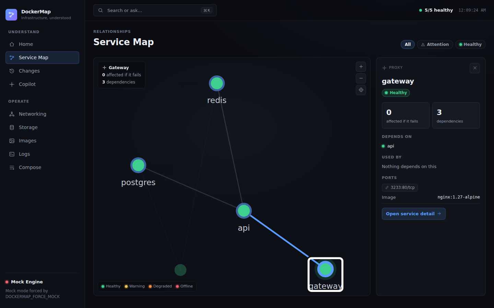
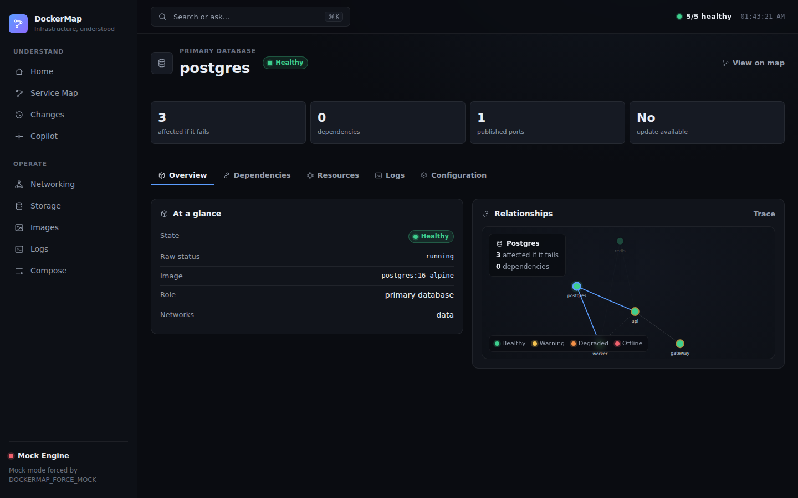

<div align="center">

```
 ██████╗  ██████╗  ██████╗██╗  ██╗███████╗██████╗ ███╗   ███╗ █████╗ ██████╗
 ██╔══██╗██╔═══██╗██╔════╝██║ ██╔╝██╔════╝██╔══██╗████╗ ████║██╔══██╗██╔══██╗
 ██║  ██║██║   ██║██║     █████╔╝ █████╗  ██████╔╝██╔████╔██║███████║██████╔╝
 ██║  ██║██║   ██║██║     ██╔═██╗ ██╔══╝  ██╔══██╗██║╚██╔╝██║██╔══██║██╔═══╝
 ██████╔╝╚██████╔╝╚██████╗██║  ██╗███████╗██║  ██║██║ ╚═╝ ██║██║  ██║██║  
 ╚═════╝  ╚═════╝  ╚═════╝╚═╝  ╚═╝╚══════╝╚═╝  ╚═╝╚═╝     ╚═╝╚═╝  ╚═╝╚═╝  
```

### Understand your whole self-hosted machine. One map, no guessing.

[](docs/deployment/DOCKER.md)
[](#-quick-installation)
[](#-quick-installation)
[](docs/security/THREAT_MODEL.md)

</div>

---

## 🚀 Quick Installation

Pick whichever you're more comfortable with. Both give you the same app at
**http://127.0.0.1:3233**.

### Option A — Docker (recommended)

```bash
docker compose up --build
```

No Compose? Plain Docker works too:

```bash
docker build -t dockermap:local .
docker run --rm -p 3233:3233 \
  -v /var/run/docker.sock:/var/run/docker.sock:ro \
  dockermap:local
```

### Option B — NPM

```bash
npm install
npm run dev:stack
```

This starts the Rust daemon (`:4100`), the Node API (`:4000`), and the web app
(`:3233`) together. Requires Node.js 22+ and the Rust toolchain pinned in
[`rust-toolchain.toml`](rust-toolchain.toml).

Full setup details, environment variables, and a host/systemd deployment guide live in
[`docs/deployment/`](docs/deployment/).

---

## 📖 About

**DockerMap is a local operational topology app for understanding one self-hosted
machine.** Docker and Compose are deep subsystems, but the map is broader than
containers: it spans Docker, systemd, tmux, package ecosystems, native processes,
reverse proxies, databases, DNS, storage, network edges, and AI workloads.

### Why this exists

Self-hosting one machine usually means juggling `docker ps`, `systemctl status`,
half-remembered tmux sessions, a couple of SSH tabs, and a mental model of which
service depends on which that lives only in your head. The most common failure mode
isn't any one tool — it's not knowing what breaks if *this* thing goes down, or that a
service is quietly running outside Docker where nothing else is watching it.

DockerMap exists to answer that clearly, in one place:

- **What's actually here?** Every service, across Docker and beyond, treated as one
  kind of thing — with status, dependencies, dependents, health, and logs.
- **What depends on what?** Select a service and see its impact radius: what it needs,
  and what breaks if it dies.
- **What changed, and is it safe to change more?** A change timeline, plus dry-run
  diffs before any edit — DockerMap never writes files or touches running services on
  its own.

The GUI is built around understanding, not container management: a Home command
center for what needs attention, a Service Map for dependencies and impact radius, a
Change Center, and an explain-only Copilot — with operational detail (networking,
storage, images, logs, Compose) and raw Docker internals available on demand, not
shown by default.

### Screenshots

**Home — what needs attention, recent change, and a map preview**


**Service Map — dependencies, health, and impact radius**


**Service detail — overview, relationships, resources, logs, and configuration**


The full design language behind these screens lives in
[`docs/design/`](docs/design/).

---

## 🗺️ Dev Roadmap

The full breakdown — concurrent work streams, dependencies, and backlog — lives in
[`docs/planning/ROADMAP.md`](docs/planning/ROADMAP.md). Short version:

**Right now:** backend and security work, not GUI redesign — treating every runtime as
one provider-neutral service entity, making systemd a first-class infrastructure layer,
discovering npm/Node.js projects alongside containers, and hardening read-only
collectors and API auth before opening a full alpha.

**Next up:** representing cross-technology chains end to end (e.g. Cloudflare → Caddy →
Docker network → container → database → volume), provider redaction fixtures, and
live-Docker/reverse-proxy release evidence.

**Long-term:** Python and native-process providers, a validation engine for real config
problems, a safe editing workflow with diff preview and automatic backups, container
metrics, drift detection, and a packaged CLI with versioned releases.

See [`docs/planning/`](docs/planning/) for the market research and detailed
implementation plan behind these decisions.

---

<div align="center">

Built for people who run their own servers.
More reference material lives in [`docs/`](docs/).

</div>
