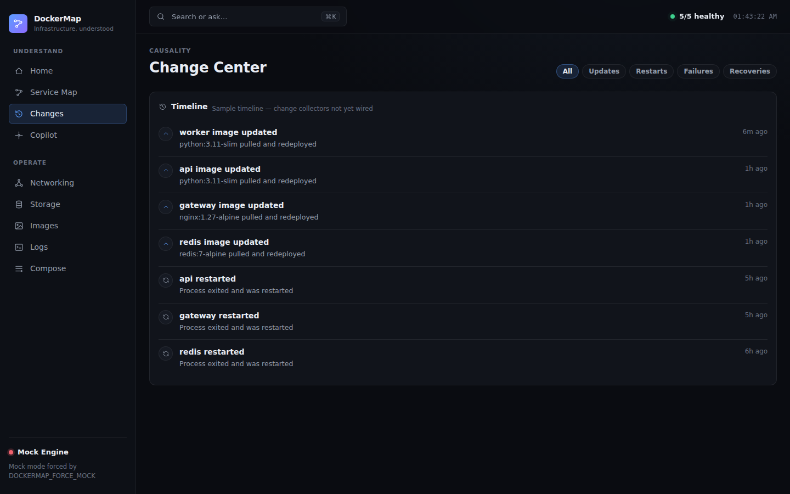
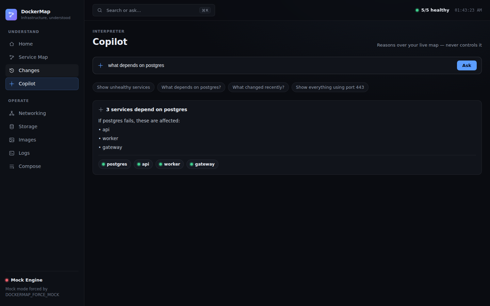
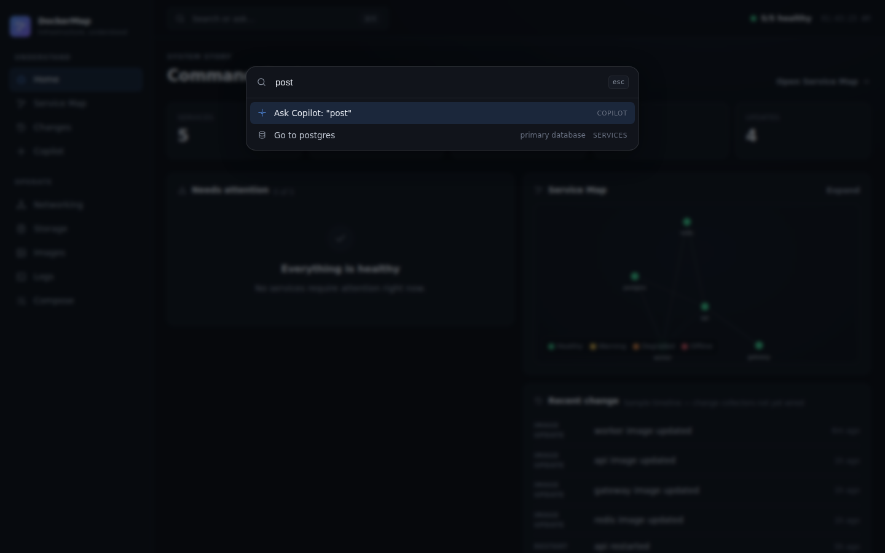

# DockerMap UI/UX Design Language

This document shows the DockerMap design language **as built**. It is the visual companion
to [DESIGN.md](DESIGN.md), which holds the principles and tokens. Where DESIGN.md says
*why*, this file shows *what it looks like*.

The interface expresses infrastructure as **services, relationships, state, and impact** —
not containers, compose files, or Docker internals. Those remain available, but only when
asked for.

## At a Glance

| Principle | How it shows up |
| --- | --- |
| Understanding over management | Spaces named for intent (Understand / Operate), not for Docker objects |
| Progressive disclosure | Four layers: system story → relationships → operations → Docker internals |
| State first | A six-state system; colour only ever encodes state |
| Information compression | Dense rows, tables, topology, and context panels — no giant cards |
| Command-palette first | ⌘K navigates, jumps to a service, or asks Copilot |
| AI explains, never controls | Copilot reasons over the live map |

## Spaces & Shell

A persistent rail groups destinations into two spaces — **Understand** (Home, Service Map,
Changes, Copilot) and **Operate** (Networking, Storage, Images, Logs, Compose). The top bar
carries the global system state (`n/total healthy`), a live clock, and the ⌘K search/ask
entry. The rail foot shows the engine connection (Docker or Mock) as a state dot plus label.

## Layer 1 — System Story (Home)

The command center answers *"what needs attention?"* in under five seconds: a compact metric
strip, an attention list, recent change, a causal chain when something is wrong, a map
preview, and pending updates.


## Layer 2 — Relationships (Service Map)

The map is the flagship. Nodes are services coloured by state; edges are relationships
coloured by edge health (healthy / slow / failing). Selecting a service reveals its **impact
radius** — what it depends on and, crucially, *what breaks if it dies* — instantly, with a
live inspector. The graph is pan/zoom and filterable by state.


## Service Detail

Everything about one service, organised as contextual tabs (Overview, Dependencies,
Resources, Logs, Configuration) rather than separate pages. An impact band sits at the top;
Docker internals (container ID, raw image ref, port bindings) live behind a Layer-4 toggle
inside Configuration.


## Change Center

Change is a first-class story: a filterable timeline of deploys, image updates, restarts,
failures, and recoveries. Markers are state-coloured. (Until daemon change collectors land,
this view is clearly labelled as a sample timeline.)



## Copilot

Copilot interprets the topology and never controls it. It answers questions like *"what
depends on postgres?"* by reasoning over the live model, then links every referenced service
for click-through.



## Command Palette (⌘K)

A primary interface, not a shortcut. It blends navigation, service jump, and an *Ask Copilot*
action over whatever you type.



## Component Language

### State dot & pill
The atom of the whole UI. A dot is a small coloured disc with a soft halo; the healthy dot
pulses. The pill adds the state label. Colour is driven by a single `--c` custom property set
by an `s-{state}` class, so every component states the same six colours one way.

### Tags
Compact metadata (image refs, ports, network names, mount kinds). Neutral by default;
`accent` for interactive/port emphasis and `warn` for read-only or risk.

### Panels
The one surface primitive. Panels own their boundary; rows live flat inside them — we never
nest a card in a card. A panel has an optional title, icon, hint, and actions.

### Metrics, bars & sparklines
Numeric truth. Metric = label + large value + optional sub. Bars and sparklines inherit the
service state colour so a CPU bar on an offline service reads correctly at a glance.

### Service map nodes & edges
Nodes carry state colour, a halo on hover/selection, and a label. Edges carry relationship
kind (solid dependency, dashed data) and an edge-health tint. The selected service's impact
set is lit; everything else dims.

### Timeline rows
Change events: a state-coloured marker, a summary that links to the service, a relative
timestamp, and an optional detail line.

### Empty, loading & error states
Empty states teach the next action (no mascots, no marketing). Loading uses a single spinner
with honest copy. Errors use the alert glyph and say what failed.

## Estimated Data

Resource samples, change history, and edge health are derived deterministically from the real
topology and **labelled as estimates** (`Estimated — live resource collectors not yet wired`)
until matching read-only collectors exist in the daemon. The label is part of the design: we
never present an estimate as live telemetry.

## Regenerating Screenshots

Screenshots are captured from the running app against the mock stack:

```bash
DOCKERMAP_CAPTURE=1 npx playwright test --config tests/e2e/playwright.config.ts capture.spec.ts
```

(The capture spec is added when refreshing screenshots and is not part of the committed test
suite.)

## Implementation Map

- Tokens and component CSS: [apps/web/src/styles.css](../../apps/web/src/styles.css)
- Domain model (services, relationships, state, impact): [apps/web/src/lib/model.ts](../../apps/web/src/lib/model.ts)
- Primitives: [apps/web/src/components/primitives.tsx](../../apps/web/src/components/primitives.tsx)
- Service map: [apps/web/src/components/ServiceMap.tsx](../../apps/web/src/components/ServiceMap.tsx)
- Command palette: [apps/web/src/components/CommandPalette.tsx](../../apps/web/src/components/CommandPalette.tsx)
